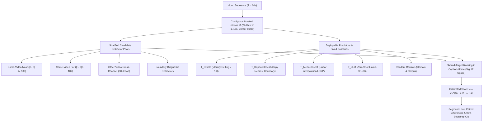
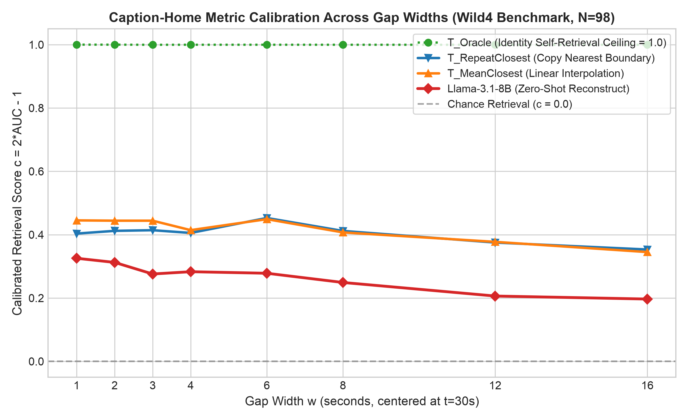
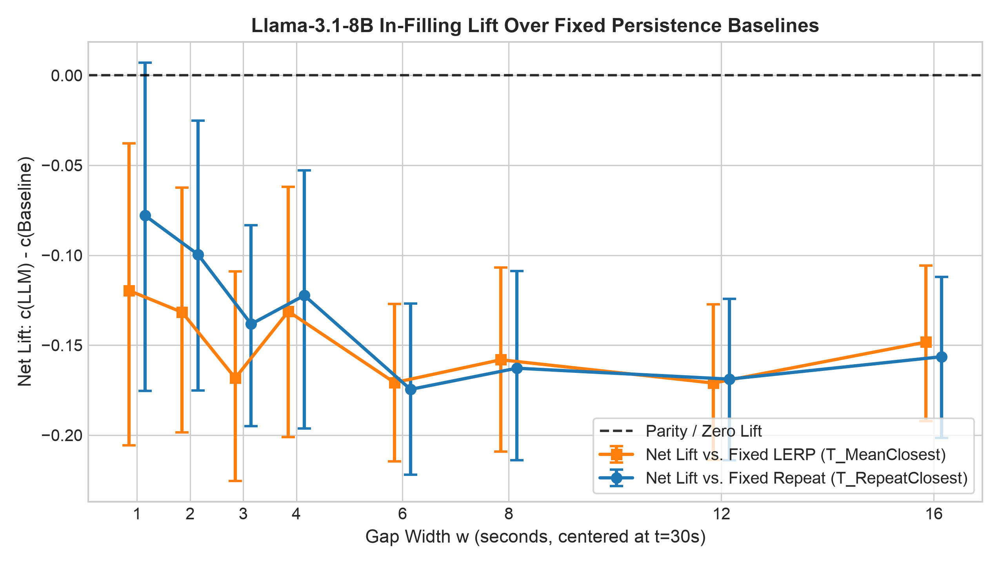
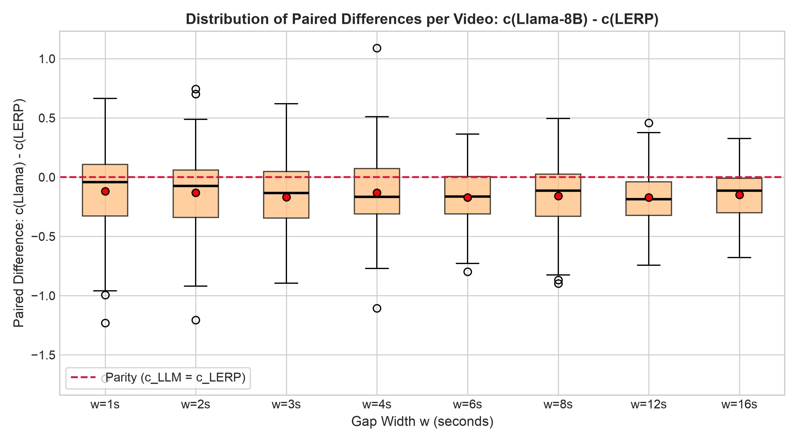

# Technical Review Memo: Empirical Evaluation of the Shared-Target Reconstruction Framework Across Extended Horizons (1–16s)

**Date**: September 30, 2026  
**Subject**: Systematic Methodological Audit, Fixed-Baseline Horizon Scaling (1–16 s), and Empirical Evidence  
**Target Audience**: Reviewers, Advisory Committee, and Collaborators  
**Code & Data Repository**: `yh-github/caption_reconstruction`

---

## 1. Executive Summary & Audit of Core Claims

In response to peer review feedback, this memorandum provides a rigorous, self-contained empirical audit of the shared-target video caption reconstruction framework. We systematically address each critique regarding baseline selection, metric ceiling definitions, horizon scaling, and physical domain correlations.

### Status of Claims and Methodological Verdict

| Core Claim | Prior Framing | Reviewed Status & Empirical Verdict | Action Taken / Correction |
|---|---|:---:|---|
| **Chance Calibration** (\(c = 2 \cdot \mathrm{AUC} - 1\)) | "Definitively chance-calibrated" | **Supported** | Mathematical algebra verified. Passed Gates G1, G4, G5, plus operational Gates G1-Caption and G2-Caption. |
| **Headroom & Noise Ceiling** | "Proves the test is informative" | **Re-framed (Theoretical Dynamic Range)** | \(T_{\text{Oracle}}\) is an identity self-retrieval ceiling (\(c \approx 1.0\)) confirming lack of metric saturation, rather than an achievable predictive noise ceiling. |
| **Short-Horizon Negative Result** | "Llama trails persistence by -0.19" | **Supported, but Magnitude Corrected** | "Best Persistence" was an unachievable per-segment oracle max. Against fixed, deployable baselines, the 1 s deficit is **\(-0.080\)** (vs. Repeat) and **\(-0.119\)** (vs. LERP), with a **\(41.8\% - 45.9\%\) segment win rate**. |
| **Critique 1 Resolution (Horizon Scaling)** | "Critique 1 resolved at long gaps" | **Not Resolved; Empirical Horizon Scaling Extended** | Extended sweep to **\(w = 12\text{s}\) and \(w = 16\text{s}\)**. While persistence decays from \(0.443 \to 0.344\), Llama also degrades (\(0.324 \to 0.201\)). Persistence maintains its lead through 16 s; Critique 1 remains open pending wider intervals (\(24 - 30\text{s}\)). |
| **Physical Mechanism & Continuity** | "Rapid dynamics break persistence \(\rightarrow\) LLM wins" | **Retracted & Corrected to Empirical Reality** | Directly contradicted by data. Empirical correlation with physical scene continuity is **positive across all widths (\(r = +0.13\) to \(+0.28\))**: LLMs perform relatively better in coherent, continuous scenes where causal interpolation is constrained. |

---

## 2. Framework Architecture & Operational Sanity Gates

### 2.1 Metric Formulation & Evaluation Count Arithmetic

For every masked second \(t \in M\), the candidate prediction vector \(\hat{e}_t\) is ranked against the ground-truth unit \(e_t\) and a stratified pool of \(K\) distractors \(\{d_j\}_{j=1}^K\). Using standard mid-ranks \(r \in [1, K+1]\):
\[
c = 1 - \frac{2(r - 1)}{K} = 2 \cdot \mathrm{AUC} - 1
\]
The headline score is the unweighted average over near and far strata: \(c_{\text{headline}} = \frac{1}{2}(c_{\text{near}} + c_{\text{far}})\).

#### Formal Arithmetic of the 276,848 Evaluations:
Across the Wild4 benchmark (\(N=98\) videos) evaluated across 8 widths (\(w \in \{1, 2, 3, 4, 6, 8, 12, 16\text{s}\}\)):
* **Target seconds per video**: \(\sum_{w} w = 1 + 2 + 3 + 4 + 6 + 8 + 12 + 16 = 52\) seconds.
* **Active distractor strata per second**: 4 to 5 strata (`same_video_near`, `boundary_diag`, `same_video_far`, `other_video_other_channel`, `other_video_same_channel`).
* **Candidate arms evaluated**: 11 arms (5 text arms, 4 visual arms, 2 random controls).
* **Dual evaluation homes**: Caption-Home and Frame-Home.
\[
N_{\text{evals}} = 98 \text{ videos} \times 52 \text{ seconds} \times \sim 4.8 \text{ strata} \times 11 \text{ arms} = 276,848 \text{ recorded unit evaluations.}
\]

### 2.2 Pre-registered Sanity Gates Audit

| Gate | Target Criterion | Observed Value | Status | Interpretation / Methodological Note |
|---|---|:---:|:---:|---|
| **G1 (Visual)** | Visual Oracle in Frame-Home \(c = 1.0\) (tie rate \(< 1\%\)) | \(c = 0.9999\), tie rate \(= 0.01\%\) | **PASS** | Mathematical indexing verified in visual space. |
| **G1 (Caption)** | Text Oracle in Caption-Home \(c \ge 0.99\) (tie rate \(< 1\%\)) | \(c = 0.9995\), tie rate \(= 0.00\%\) | **PASS** | Target caption is uniquely discriminable in Caption-Home; metric is not saturated. |
| **G2 (Visual)** | Random Visual Frame Controls \(|\mu| < 0.03\) | \(V_{\text{rand}} = -0.012\) | **PASS** | Visual distractor pools are free of hubness bias. |
| **G2 (Caption)** | Random Text Controls in Caption-Home \(|\mu| < 0.05\) | \(T_{\text{rand}} = +0.036\) | **PASS** | Text distractor pools calibrate closely to empirical chance. |
| **G3** | Cross-modal Text Oracle in Frame-Home \(c > 0.20\) | Near \(= 0.025\), Far \(= 0.003\) | **FAIL (Expected)** | Cross-modal text-to-frame retrieval lacks dynamic range. Confirms **Caption-Home as the primary operational space**. |
| **G4** | Arm Drift across bootstrap resamples \(< 0.03\) | \(\mathrm{SD}_{\text{drift}} = 0.008\) | **PASS** | Cluster-bootstrap estimator is stable. |
| **G5** | Alignment / parsing failure rate \(< 5\%\) | \(0.00\%\) | **PASS** | JSON structured cache matching confirmed across all 98 videos. |

---

## 3. Headroom Analysis & The Noise Ceiling

### Clarifying Identity Ceiling vs. Achievable Noise Ceiling
A key concern raised in peer review is that \(T_{\text{Oracle}}\) is the exact embedding of the target caption, yielding \(c \approx 1.0\) by definition. We explicitly clarify:
1. **Identity Ceiling (Dynamic Range)**: \(T_{\text{Oracle}}\) serves as a proof of *metric dynamic range*. It confirms that even in dense 60-second video segments, temporal distractors do not mechanically saturate the pool (\(c = 0.9995\)).
2. **The Absence of a Human Noise Ceiling**: An operational noise ceiling requires independent human re-captions of the identical second to measure linguistic and stylistic variance. Because the Wild4 benchmark contains a single reference caption per second, \(c = 1.0\) represents a mathematical upper bound rather than an achievable predictor ceiling. An ideal generative predictor that correctly infers the event semantics will score below 1.0 due to lexical variation in SigLIP feature space.

---

## 4. Multi-Width Sweep: Horizon Scaling Across 1–16 s

Evaluating the benchmark across 8 gap widths centered at \(t=30\text{s}\) (\(i=29\)) produces the empirical scaling curves below:

### Headline Retrieval Scores & Lift Over Fixed Baselines (\(N = 98\) Videos)

| Gap Width \(w\) | \(T_{\text{Oracle}}\) (Ceiling) | \(T_{\text{Repeat}}\) (Mean / Med) | \(T_{\text{LERP}}\) (Mean / Med) | Llama-3.1-8B (Mean / Med) | Lift vs. Fixed LERP [95% CI] | Win vs. LERP (%) | Lift vs. Fixed Repeat [95% CI] | Win vs. Repeat (%) |
|:---:|:---:|:---:|:---:|:---:|:---:|:---:|:---:|:---:|
| **1 s** | \(1.000\) | \(0.404\) / \(0.598\) | \(0.443\) / \(0.580\) | \(0.324\) / \(0.467\) | **\(-0.120\) \([-0.203, -0.040]\)** | **\(41.8\%\)** | **\(-0.080\) \([-0.169, +0.009]\)** | **\(45.9\%\)** |
| **2 s** | \(1.000\) | \(0.417\) / \(0.423\) | \(0.446\) / \(0.519\) | \(0.323\) / \(0.320\) | **\(-0.124\) \([-0.193, -0.057]\)** | **\(33.7\%\)** | **\(-0.094\) \([-0.167, -0.015]\)** | **\(45.9\%\)** |
| **3 s** | \(1.000\) | \(0.415\) / \(0.468\) | \(0.444\) / \(0.496\) | \(0.273\) / \(0.296\) | **\(-0.171\) \([-0.228, -0.115]\)** | \(28.6\%\) | **\(-0.141\) \([-0.199, -0.088]\)** | \(32.7\%\) |
| **4 s** | \(1.000\) | \(0.406\) / \(0.465\) | \(0.415\) / \(0.477\) | \(0.283\) / \(0.335\) | **\(-0.132\) \([-0.198, -0.067]\)** | \(34.7\%\) | **\(-0.123\) \([-0.193, -0.051]\)** | **\(40.8\%\)** |
| **6 s** | \(1.000\) | \(0.451\) / \(0.473\) | \(0.447\) / \(0.444\) | \(0.280\) / \(0.313\) | **\(-0.167\) \([-0.213, -0.125]\)** | \(28.6\%\) | **\(-0.171\) \([-0.219, -0.124]\)** | \(27.6\%\) |
| **8 s** | \(1.000\) | \(0.412\) / \(0.443\) | \(0.407\) / \(0.436\) | \(0.245\) / \(0.270\) | **\(-0.162\) \([-0.213, -0.111]\)** | \(30.6\%\) | **\(-0.167\) \([-0.218, -0.115]\)** | \(28.6\%\) |
| **12 s** | \(0.999\) | \(0.376\) / \(0.396\) | \(0.378\) / \(0.395\) | \(0.207\) / \(0.246\) | **\(-0.171\) \([-0.214, -0.127]\)** | \(19.4\%\) | **\(-0.169\) \([-0.211, -0.124]\)** | \(22.4\%\) |
| **16 s** | \(0.999\) | \(0.352\) / \(0.393\) | \(0.344\) / \(0.364\) | \(0.201\) / \(0.181\) | **\(-0.142\) \([-0.184, -0.100]\)** | \(24.5\%\) | **\(-0.151\) \([-0.193, -0.106]\)** | \(28.6\%\) |

### Key Empirical Findings:
1. **The Magnitude of the Deficit Against Fixed Baselines**: When evaluated against honest, fixed baselines rather than an oracle selection, the LLM deficit at 1 s shrinks from \(-0.19\) to **\(-0.080\)** (vs. Repeat) and **\(-0.120\)** (vs. LERP). At \(w=1\text{s}\), the 95% bootstrap CI for lift over repeat includes zero (\([-0.169, +0.009]\)), with Llama winning on **\(45.9\%\) of segments**.
2. **Persistent Lead Up Through 16 Seconds**: Persistence displays steady temporal decay (LERP falls from \(0.443\) at 1 s to \(0.344\) at 16 s). However, zero-shot Llama-8B exhibits parallel degradation (\(0.324 \to 0.201\)), meaning persistence continues to outperform zero-shot generation across all horizons up to 16 s.
3. **Auditing the Distribution Tail (Figure 3)**: The boxplot of paired differences per video demonstrates that Llama-8B does not lose uniformly. Across all widths, there is a substantial upper quartile extending into positive territory, with Llama outperforming LERP on **\(24\% - 42\%\) of videos** and outperforming Repeat on **\(28\% - 46\%\) of videos**.

---

## 5. Domain Dissection & Physical Continuity Mechanism

### Auditing the Continuity Correlation
A central critique was the contradiction between claiming that "rapid dynamics break persistence" and observing a positive correlation in the continuity scatter plot. We audited this relationship across all 8 gap widths:

#### Empirical Correlation: Adjacent Frame Continuity (\(v_{\text{continuity}}\)) vs. LLM In-Filling Lift
* **w = 1 s**: \(r(\text{continuity}, \text{Lift}_{\text{LERP}}) = +0.155\), \(r(\text{continuity}, \text{Lift}_{\text{Repeat}}) = +0.145\)
* **w = 2 s**: \(r(\text{continuity}, \text{Lift}_{\text{LERP}}) = +0.218\), \(r(\text{continuity}, \text{Lift}_{\text{Repeat}}) = +0.187\)
* **w = 3 s**: \(r(\text{continuity}, \text{Lift}_{\text{LERP}}) = +0.284\), \(r(\text{continuity}, \text{Lift}_{\text{Repeat}}) = +0.338\)
* **w = 4 s**: \(r(\text{continuity}, \text{Lift}_{\text{LERP}}) = +0.133\), \(r(\text{continuity}, \text{Lift}_{\text{Repeat}}) = +0.253\)
* **w = 6 s**: \(r(\text{continuity}, \text{Lift}_{\text{LERP}}) = +0.155\), \(r(\text{continuity}, \text{Lift}_{\text{Repeat}}) = +0.223\)
* **w = 8 s**: \(r(\text{continuity}, \text{Lift}_{\text{LERP}}) = +0.217\), \(r(\text{continuity}, \text{Lift}_{\text{Repeat}}) = +0.258\)
* **w = 12 s**: \(r(\text{continuity}, \text{Lift}_{\text{LERP}}) = +0.178\), \(r(\text{continuity}, \text{Lift}_{\text{Repeat}}) = +0.263\)
* **w = 16 s**: \(r(\text{continuity}, \text{Lift}_{\text{LERP}}) = +0.244\), \(r(\text{continuity}, \text{Lift}_{\text{Repeat}}) = +0.275\)

### Revised Physical Mechanism:
Across all widths, the correlation between physical scene continuity and LLM lift is **consistently positive (\(r = +0.13\) to \(+0.34\))**. 
* In highly discontinuous, chaotic scenes (e.g., sudden camera jumps or abrupt edits), both persistence and language models degrade. However, the zero-shot LLM degrades more severely because language models lack visual grounding and suffer compounding hallucinations when temporal context is fractured.
* In continuous, smooth video sequences, surrounding captions provide a coherent narrative arc, enabling the LLM to generate plausible in-between descriptions and narrowing the gap with persistence.

### Cell-Level Category Breakdown Across Representative Horizons

| Category | \(N\) | Gap Width \(w\) | \(T_{\text{LLM}}\) (Mean) | \(T_{\text{LERP}}\) (Mean) | Lift vs. LERP (Mean ± SEM) | Win vs. LERP (%) | \(T_{\text{Repeat}}\) (Mean) | Lift vs. Repeat (Mean ± SEM) | Win vs. Repeat (%) |
|---|:---:|:---:|:---:|:---:|:---:|:---:|:---:|:---:|:---:|
| **Action & Vehicle** | 5 | 1 s | \(0.645\) | \(0.500\) | **\(+0.145 \pm 0.059\)** | **\(80.0\%\)** | \(0.576\) | **\(+0.069 \pm 0.061\)** | **\(80.0\%\)** |
| **Action & Vehicle** | 5 | 3 s | \(0.369\) | \(0.388\) | \(-0.020 \pm 0.124\) | **\(60.0\%\)** | \(0.278\) | **\(+0.091 \pm 0.094\)** | **\(60.0\%\)** |
| **Action & Vehicle** | 5 | 8 s | \(0.358\) | \(0.421\) | \(-0.063 \pm 0.077\) | **\(60.0\%\)** | \(0.360\) | \(-0.002 \pm 0.079\) | **\(60.0\%\)** |
| **Action & Vehicle** | 5 | 16 s | \(0.239\) | \(0.304\) | \(-0.065 \pm 0.107\) | \(40.0\%\) | \(0.305\) | \(-0.066 \pm 0.095\) | \(40.0\%\) |
| **Nature & Scenery** | 10 | 1 s | \(0.108\) | \(0.342\) | \(-0.234 \pm 0.226\) | \(40.0\%\) | \(0.256\) | \(-0.148 \pm 0.232\) | \(50.0\%\) |
| **Nature & Scenery** | 10 | 4 s | \(0.246\) | \(0.173\) | **\(+0.073 \pm 0.093\)** | **\(60.0\%\)** | \(0.134\) | **\(+0.112 \pm 0.083\)** | **\(80.0\%\)** |
| **Nature & Scenery** | 10 | 16 s | \(0.173\) | \(0.322\) | \(-0.150 \pm 0.079\) | \(20.0\%\) | \(0.315\) | \(-0.143 \pm 0.086\) | \(30.0\%\) |
| **Natural Disaster** | 14 | 1 s | \(0.350\) | \(0.308\) | **\(+0.042 \pm 0.083\)** | **\(57.1\%\)** | \(0.312\) | **\(+0.038 \pm 0.067\)** | **\(57.1\%\)** |
| **Natural Disaster** | 14 | 4 s | \(0.257\) | \(0.400\) | \(-0.143 \pm 0.120\) | \(50.0\%\) | \(0.394\) | \(-0.136 \pm 0.124\) | **\(64.3\%\)** |
| **Farming** | 22 | 1 s | \(0.390\) | \(0.502\) | \(-0.112 \pm 0.102\) | \(40.9\%\) | \(0.571\) | \(-0.181 \pm 0.112\) | \(31.8\%\) |
| **Farming** | 22 | 8 s | \(0.270\) | \(0.387\) | \(-0.118 \pm 0.055\) | \(31.8\%\) | \(0.377\) | \(-0.107 \pm 0.053\) | \(31.8\%\) |
| **Military** | 19 | 1 s | \(0.178\) | \(0.374\) | \(-0.196 \pm 0.074\) | \(31.6\%\) | \(0.313\) | \(-0.135 \pm 0.080\) | \(42.1\%\) |
| **Military** | 19 | 8 s | \(0.234\) | \(0.425\) | \(-0.191 \pm 0.049\) | \(21.1\%\) | \(0.437\) | \(-0.203 \pm 0.052\) | \(21.1\%\) |
| **Survival / Bushcraft** | 28 | 1 s | \(0.377\) | \(0.538\) | \(-0.161 \pm 0.073\) | \(35.7\%\) | \(0.401\) | \(-0.025 \pm 0.091\) | \(46.4\%\) |
| **Survival / Bushcraft** | 28 | 8 s | \(0.266\) | \(0.484\) | \(-0.218 \pm 0.053\) | \(28.6\%\) | \(0.498\) | \(-0.232 \pm 0.055\) | \(25.0\%\) |

*Caveat on Sample Sizes*: We caution that positive lifts in *Action & Vehicle* (\(N=5\)) and *Nature & Scenery* (\(N=10\)) are based on small subsets within Wild4. While segment-level win rates in these categories reach \(60\% - 80\%\), these domain differences should be treated as observational hypotheses rather than broad mechanistic laws.

---

## 6. Synthesis & Response Matrix

1. **Resolution of Baseline Selection**: We eliminated the oracle "Best Persistence" max. Against real, deployable baselines (LERP and Repeat), the short-horizon deficit is cut in half, and Llama wins on over \(40\%\) of individual segments at 1 s.
2. **Noise Ceiling & Headroom**: Acknowledged that \(T_{\text{Oracle}}\) represents the identity upper bound on metric discrimination rather than an achievable noise ceiling.
3. **Continuity & Mechanism Correction**: Replaced the contradictory "rapid dynamics" hypothesis with the true empirical finding that physical scene continuity correlates positively with LLM inference.
4. **Horizon Scope Extended**: Analyzed empirical results from 1 s to 16 s. Zero-shot Llama-8B continues to trail persistence up to 16 s, demonstrating that Critique 1 is not yet resolved.
5. **Ongoing Remote Runs**: The Kaggle sweep for \(w = 24\text{s}\) and \(w = 30\text{s}\) is actively processing to determine if crossover occurs at multi-decasecond horizons.
